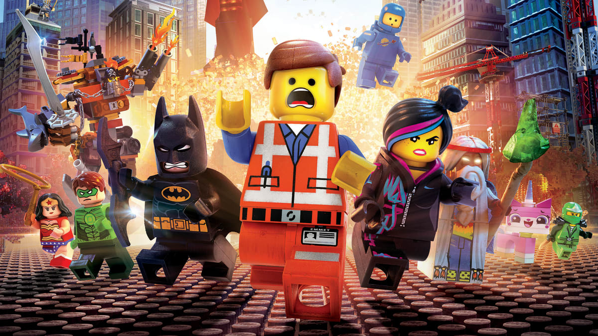
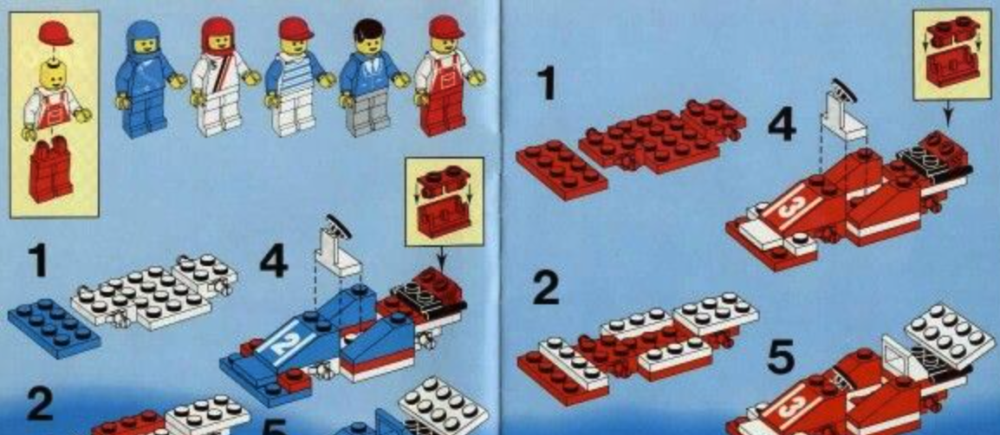
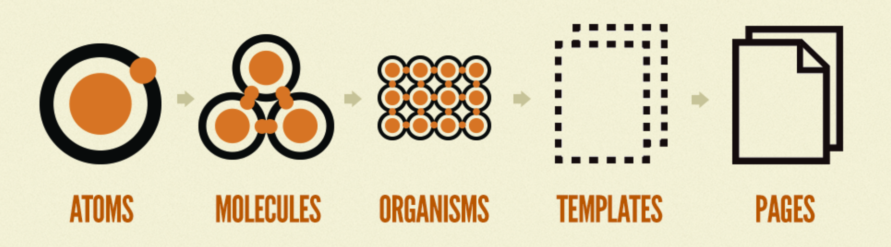
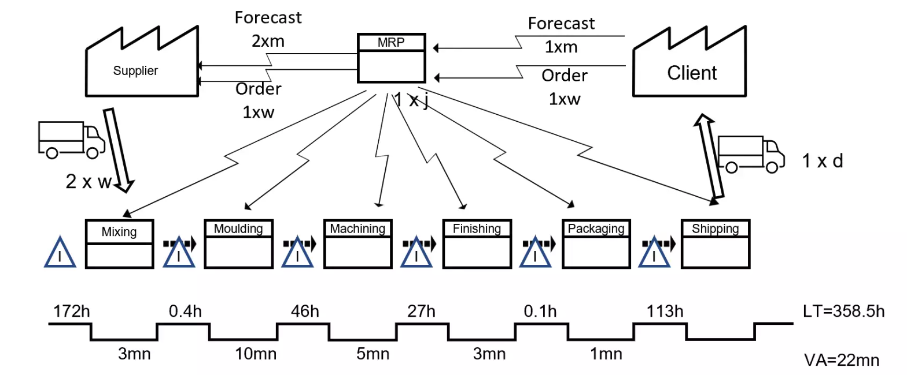

# Atomic-Blocks Blog platform

As a small child, I was fascinated by the toy Lego, where a range of blocks could be used to build cars, houses, and combined with electronics, even more potential. The blocks were for example 2 dots by 4 dots in size. Another was 1 dot by 8 dots. These can be assembled to create by a young engineer to create a great number of inventions unique in his/her nascent, growing mind. A cable car to climb to the upstairs of our home. A motorised, 'remote control' truck. Etc. Etc. All built from the same reusable blocks.

As I worked with the component-driven architecture approach of systems like React, Angular, Vue, Svelte, etc. it struck me that these components, for example, a button component, are akin to 'Lego blocks' in that they are grouped together to form websites. I noticed that these were nonetheless often assembled for only one purpose. Different teams in the same organisation would create their own series of bespoke blocks, when they could, for example, have used the same button component, especially as the company ideally would have a common colour scheme, etc. for their websites. Working over the last two decades as a software engineer,  too often I have seen short-tempered project managers screaming at developers to do overtime, while essentially directing they write the same code over and over. 

The object of this project is to explore the potential to harness a library of resuable blocks (components; chunks of code) representating functionality (which you could pair with Storybook) in such a manner that they can easily be 'clicked' together to create more than one website. Greater potential for utilisation of such a library is opened by by options to apply several themes to the same components. This follows in the spirit of computer science to avoid duplication of effort, e.g. methods/functions, Object-Oriented Programming/classes, smart/dumb components, micro-frontends, etc.. 

For example, a 'Lego block' equivalent could be button functionality. Another block may be a text input field. Another may be a datepicker. Following the [atomic design approach](https://bradfrost.com/blog/post/atomic-web-design/), blocks can be connected to create, for example, a form. These larger chunks of reusable code (that being functionality) are referred to as molecules. A schema for said form can be saved, and reutilised for many purposes.

**Organisms, Pages, and Websites/Apps:** This grouping of items can be developed further, bringing these reusable components together as sections of a page, which are reffered to as an 'orgamism'. For example, one type of molecule may be a short description of a blog post, while an organism may be the list of blog posts. Together with a header organism, this 'blog posts list' organism may be part of a 'blog' page. Even, such pages could form the entire UI of a website or mobile app. This being akin to how a construction site could assemble a house brick by brick, or use prefabricated sections created in a factory. The difference here being the 'economies in scale', in that one does not have the same overhead costs to assemble each prefabricated section. One can, to describe this in a crude, simplified fashion, 'copy and paste' sections, or that is, deployed a new instance of the objects.

***Graphic/UX designers:*** If one is relying on such a component library, and one that can utilise more than one theme, then the opportunity arises to align with the effort of UI visual designers, e.g. a UX designer can design a workflow, colour schemes, 'calls to action', etc. that reflect various aspects of psychology, such as the 'hook model'. If this design is built such that it can be applied to the component library, there opportunity exists to export such from a system such as Figma, and utilising a CSS styling system, such as TailwindCSS, to deploy the design. This would essentially mean that with limited (if any) technical knowledge, or often no code changes, amd in a similar fashion to say Wordpress, or Wix, stakeholders could deploy a great deal of functionality, and in a similar fashion to a CMS, make a great number of tweaks.

**Micro-frontends:** The organism could be a micro-frontend, utilising technologies such as SingleSpa, and/or Module Federation, and supported by a microservice acting as a BFF. 

**Six Sigma:** There is the potential (a la Spotify model) for a [value stream](https://en.wikipedia.org/wiki/Value-stream_mapping) to be aligned with an 'organism' or 'page' in the atomic system, e.g. a steam to delivery a blog functionality utlised across the websites of 5 different clients. ***Value streams:*** In contrast to the original Agile manifesto, often today, there are attempts for a 'one size fits all' rigid implementation of Scrum, though the 2-week sprints, etc., seem a little dated with CI/CD now 'old news', and the broader eco-system of many companies is far from ready, or even open, to a more Agile way of working. The underlying concepts/principles are missed by 'Cargo Cult Agile', i.e, this could be simplied as to prioritise requirements by value and to focus on those critical to get the project launched (How often did that ever happen, despite all the Sprint Planning meetings, etc.?), and do those first, but check-in reguarly with customers to check works heading in right direction (How often do they attend the Sprint Review?), i.e. meets perceived need Engineering teams are sometimes focussed on an engineering function, or as a project manager would see them in Waterfall, e.g. a back-end team, or a QA team, and part of the justification given by some project managers, and Scrum Masters, for their role, is to faciliate communication between these silos. Meanwhile, the broader business may instead perceive works as products that the customer would purchase. This misalignment can be addressed with 'feature squads', along with the associated concept of Toyota's value steam mapping (a la Six Sigma; and getting back to what Agile was really about, i.e. learning from early Toyota's efficient management system.) That is to design the dynamics of workflow through engineering staff to form product delivery streams, but with domain-driven architecture (hence, caution on misinterpretation of 'product-led', but rather hollistic, considering also, for example, 'tech debt' to ensure delivery; Scrum lacks, and few businesses would allow for, an [Andon cord](https://en.wikipedia.org/wiki/Andon_(manufacturing)).) This would provide far more efficiency than any 'Retro' meeting that has diverted from discussing 'kaizens' into a pseudo-therapy session that talks about feelings but does not address the 'root cause' of problems. 

**Job security:** How would this impact engineering roles? The world is moving this direction already, and I do not beleive my project has any influence on that. Over the last two decades, there have been systems such as Wordpress, Joomla, Wix, SquareSpace, etc., as it gets easier and easier for people to launch their own website. Nonetheless, few people do. Hypothetically, you could do you own accounts, but most businesses (or people earning over £100k) pay an accountant, for the 'peace of mind' (and a 'piece of his mind'?) Many who can afford to hire a gardener, when they are more than capable of planting some flowers, and reading up on how to care for them. The major impact of these advances in UI development will be that less skills would be required. This being in a market where consultancies focused on head count rather than reliability have pushed into the industry millions of 'copy pasta' 'script kiddies' produced by 'rote learning' at some of the lowest ranking univeristies that are little more than 'paper mills'. (Project management 'ethos' embraces hiring of low-skilled technicians to create 'quick and dirty' fixes to meet arbitrary deadlines. That does not allow for a carefully-determined balance, an empirically-calculated risk management approach, i.e. consider the' big picture', with respect either to 'return on investment' to the business, or the criticality of technical systems reliability to repuation and client retention. However, it does create unnecessary situations to 'heroically' patch a fix, the 'fire drill' in response to failings of past rushed work, and drama to cover-up equivalents to Horizon scandals, Boeing Spirit airplane windows, and Challenger space ship explosions.)

## Data Source

This currently uses Firebase (alternate Supabase could be utilised.) I have partially-completed alternate data provision from two other data sources: DynamoDB, and MongoDB. (I am tempted to look at a SQL version too.) 

##

For MongoDB, I have partially-written Python middle-ware to present data from MongoDB

firebase deploy

https://portfolio-mathematicus-lucian.web.app/

This project was generated with [Angular CLI](https://github.com/angular/angular-cli) version 17.0.8.

## Development server

Run `ng serve` for a dev server. Navigate to `http://localhost:4200/`. The application will automatically reload if you change any of the source files.

## Code scaffolding

Run `ng generate component component-name` to generate a new component. You can also use `ng generate directive|pipe|service|class|guard|interface|enum|module`.

## Build

Run `ng build` to build the project. The build artifacts will be stored in the `dist/` directory.

## Running unit tests

Run `ng test` to execute the unit tests via [Karma](https://karma-runner.github.io).

## Running end-to-end tests

Run `ng e2e` to execute the end-to-end tests via a platform of your choice. To use this command, you need to first add a package that implements end-to-end testing capabilities.

## ESLint

## Further help

To get more help on the Angular CLI use `ng help` or go check out the [Angular CLI Overview and Command Reference](https://angular.io/cli) page.
